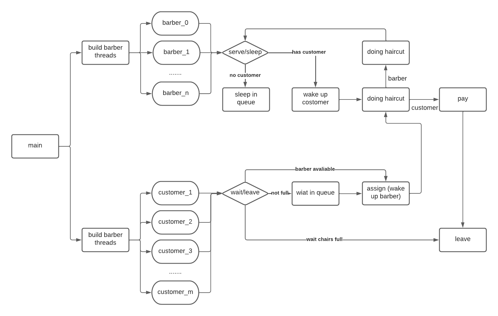

# CSS430 Lab4 Documentation

## Overview
---
This project is to extend the Single-barber Multiple-customer to Mutiple-barber Multiple-customer
with pthread_mutex lock and pthread_condition_signal.

## Instruction
---
### I did a couple modify in the original driver.cpp file.

1. I added forth argument of number of barbers in order to implement multiple barbers.
2. I added a premeter barber_id for customer object, so the customer knows who is the barber.

## Implementation
---

### Workflow

1. Create all barbers.
2. Generate customer in random time range of 0 -  999 ms.
3. Customer seeks a free barber and wakes up the barber.
4. If there is no free barber, customer wait in a free chair.
5. If there is no free chair, customer leaves.
6. Barber gets woke up then serves the customer.
7. Barber finish haircut then asks the customer to pay.
8. Customer pays then leave.
9. Barber asks the next customer.
10. If there is no customer, barber sleeps.

### The design of the project



### Code detail

1. The project use one pthread_mutex_lock and multiple pthread condition signals to implement multi-thread. 
    
```
pthread_mutex_t mutex_;                  // lock for the critical section
pthread_cond_t  cond_customers_waiting_; // signal for the first customer in the waiting queue
pthread_cond_t  *cond_customer_served_;  // signal for current customer of barber[i]
pthread_cond_t  *cond_barber_sleeping_;  // signal for barber[i]
```
 
2. A int queue sleeping_barbers_ is used to store all free barbers' ids.

```
queue<int> sleeping_barbers_; // includes the ids of all sleeping barbers.
```

3. A bool array money_paid_ is used to track if each barber gets paid after haircut.

```
bool *money_paid_;
```

4. A int arrary customer_in_chair_ is used to store the customer in service.

```
int *customer_in_chair_;
```

## Discussion
---
### Theoretically Calculation

- Customer visits the shop in a rand() % 1000 ms, which is in range of [0 - 999] ms.
- Worst case: every customer visits the shop at 0 ms.
- Best case: every customer visits the shop at 999 ms.
- Average case: every customer visits the shop at 499.5 ms.

### Case 1: 1 barber, 200 customers, and 1000 ms per haircut. How many chairs are needs?

- Worst case: we need 199 chairs for all customers.
- Best case: we need 1 chair for all customers.
- Average case: we need 2 chairs for all customers.
- Actrual situation: after 50 tests, we need about 103 chairs to avoid customer loss.

### Case 2: 0 chair, 200 customers, and 1000 ms per haircut. How many barbers are needs?

- Worst case: we need 199 barbers for all customers.
- Best case: we need 2 barbers for all customers.
- Average case: we need 3 barbers for all customers.
- Actrual situation: after 50 tests, we need about 6 barbers to avoid customer loss.

## Note
---
I did a test for 32,000 customer, there is no segmentation fault, but it runs really slow. 
I tracked the CPU usage, The instant usage jumps to 300%. I don't know how can it happens. 